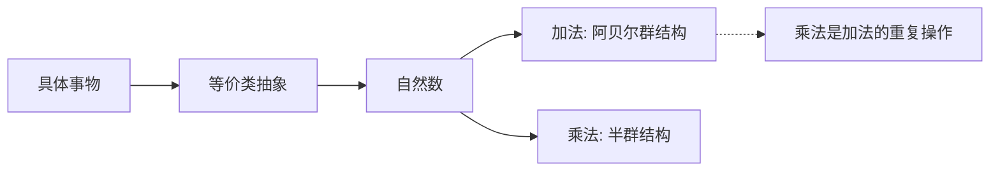

我来分析这个文档中的核心数学推论和可能的解决思路。

## 文档核心问题梳理

### 一、核心命题：能否创造超越"是非二元"的数学符号系统？

作者基于一个类比：
- 超越数（π、e）在数字领域是"无处不在、好像没有规律、等待被发现"的数
- 能否创造类似的"超越性符号"——在运算符号层面达到类似效果？

**可能的解决路径：**

1. **打破二元逻辑约束**
   - 哥德尔不完备定理证明：在包含算术的形式系统中，总存在无法证明也无法证伪的命题
   - 这恰好暗示了"灰色地带"的存在
   - 解决思路：引入**模糊逻辑**或**三值逻辑**（是、否、不确定）作为运算基础

2. **符号运算的自我指涉**
   - 当前：数字是运算对象，符号是操作规则
   - 突破：当符号本身成为可运算对象时，产生"元数学"层级
   - 类比：程序可以操作程序本身

---

### 二、核心推论：数学是"压缩"，新压缩等待发现

作者的关键论点：
```
具体事件 → 文字描述 → 数学符号 → 运算公式 → 应用
   (失真/压缩过程)
```

**推论：** 数字是压缩，符号计算方式也是压缩 → 存在未被探索的压缩维度

**验证此推论的方法：**

1. **公理化扩展**
   - 从现有公理出发，推导新的运算闭包
   - 若新运算满足闭合性、结合性等代数结构，可证明其"数学合法性"

2. **构造性证明**
   - 找一个具体例子：现有运算+新运算=新数字系统
   - 检验新系统是否产生"超越性元素"（类似超越数）

---

### 三、加法与乘法本质区别的哲学问题

> "乘法就是加法的一个组合运算规则"
> "2+2=4 和 2×2=4 的本质区别是什么？"

**数学上的区分：**
- 加法：abstraction of "collection merging"（合并）
- 乘法：abstraction of "scaling"（缩放）或笛卡尔积

**更深层结构：**


关键洞察：乘法不一定是加法的"本质包含"，在抽象代数中可以是独立的代数结构（如矩阵乘法≠矩阵加法的重复）

---

### 四、因果双向性问题

作者感悟：果也可以影响因，等式是双向的

**数学形式化：**
- 传统因果：A → B（单向）
- 数学等式：A = B 意味着 B = A（双向）
- 微分方程：y' = f(x,y) 中，y的导数同时受x和y影响，形成反馈回路

**形式化框架：**
- 贝叶斯网络：因果图可以双向推断
- 动力系统：因果关系是微分方程，状态互相决定

---

### 五、形式化证明中的符号创造问题

> "新符号代表的逻辑关系是什么？我们需要定义吗？还是说，这是一个可以发现的规律？"

**两个选择：**

| 路径 | 含义 | 示例 |
|------|------|------|
| **定义** | 任意约定，创造新语义 | 创建新运算符，规定其运算规则 |
| **发现** | 揭示已有结构的隐藏性质 | 群论中发现新子结构 |

**作者的核心假设验证路径：**

> "能否用已有数学公理推导出新的数学运算方法？"

**可计算性验证：**
1. 选取ZFC公理系统
2. 定义"运算生成规则"（如：从现有运算组合生成新运算）
3. 用图灵机/λ演算模拟此过程
4. 检验是否产生新运算符号及其对应的可证明命题

---

## 总结：文档推论的核心路径

```
起点：哥德尔不完备 → 二元逻辑的局限
       ↓
核心假设：符号系统存在"超越性"维度（类比超越数）
       ↓
验证方向：
  ① 模糊逻辑/多值逻辑 → 打破是非二元
  ② 公理化扩展 → 从旧运算生成新运算
  ③ 图灵机模拟 → 形式化验证可能性
  ④ 因果双向性 → 微分方程/动力系统框架
       ↓
目标：创造能不断推导新数学运算符号的AI系统
```

这个推论的核心困难在于：如何在**保持数学严格性**的同时，引入**超越"定义-发现"二分**的创造性。如果要进一步形式化，建议从**范畴论**角度切入——范畴论本身研究的就是"结构之间的关系结构"，可能更适合处理"符号的符号"这类问题。